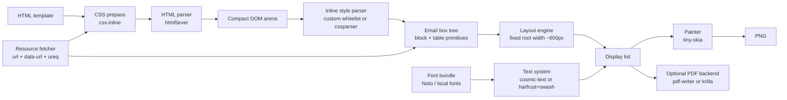

# Minimal Rust Email Template Renderer

## Executive Summary

The best production-capable design for your constraints is **not** “a small browser.” It is an **email-specific renderer** with a deliberately narrow contract: preprocess HTML into **inline styles**, parse it into a **compact custom DOM**, run a **custom table/block layout engine** for the email subset, shape text with a **Rust-native text stack**, and paint to a CPU pixmap for PNG output. That approach avoids the memory floor of browser engines, avoids JavaScript entirely, stays deterministic, and lets you enforce strict fetch/time/resource policies. The most pragmatic default stack is `css-inline` → `html5ever` → custom layout → `cosmic-text` + `tiny-skia` → PNG, with optional PDF via `pdf-writer` or `krilla`. `html5ever` remains the most robust Rust HTML parser; `css-inline` is explicitly aimed at email-like preprocessing; `cosmic-text` already integrates shaping, fallback, layout, and rasterization; `tiny-skia` is a small CPU-only painter but intentionally leaves text rendering to other crates. citeturn23search1turn21view1turn20view4turn38view1

Under a **sub-200 MB target**, this is realistic **if** you keep the renderer narrow: fixed root width around 600 CSS px, no JS, no flex/grid, very limited CSS property support, a curated local font bundle, strict image decode limits, and worker-process isolation. It becomes unrealistic if you allow arbitrary remote stylesheets, large decoded images, full system-font scanning, or browser-level CSS behavior. `fontdb` can scan system font directories, but its own docs note that it does this by directory scanning rather than platform APIs; for deterministic workers you should usually ship explicit font files instead. `image` has limit APIs for bounding decode size and documents a default allocation limit of 512 MiB, which is far too high for your target and should be reduced aggressively. citeturn20view3turn24search8turn11search1turn39view1turn39view2

If you want the shortest path to “working screenshots,” use `cosmic-text` first and only drop down to `harfrust`/`rustybuzz` + `swash` when you have hard evidence that the integrated stack is too heavy or too opinionated. `cosmic-text` already recommends one `FontSystem` and one `SwashCache` per application and exposes `Buffer::draw`/layout-run APIs that fit a custom software painter well. For CJK and emoji, a bundled Noto set is the most predictable choice: the official Noto project covers more than 1000 languages and 150+ writing systems, the Noto CJK repository publishes multiple formats and subsets, and Noto Color Emoji is explicitly meant to cover Unicode emoji. citeturn36view0turn36view3turn33search6turn33search1turn33search5turn33search2

My assumptions for the recommendations below are: one document rendered at a time; Linux or macOS local worker; no JavaScript; a bounded viewport near 600 CSS px wide; email HTML that is predominantly table-based; and a willingness to define a **support matrix** instead of “whatever a browser does.”

## Recommended Crate Stack

I prioritized **primary sources** in this order: `docs.rs` crate docs and metadata, official GitHub repositories and releases, and official project docs. The “stability” labels below are my engineering assessment based on versioning, docs warnings, and maintenance signals. citeturn23search4turn21view1turn35search3turn34search4

| Layer | Recommendation | Why this is the right default | Version / stability | Primary sources |
|---|---|---|---|---|
| HTML parsing | `html5ever` | Browser-grade HTML5 parser from the Servo project; parses/serializes according to WHATWG, with strong test pedigree. It **does not** provide a DOM tree, which is a feature here: build your own compact arena instead of dragging in a browser DOM. | `0.39.0` / mature | citeturn23search1turn23search4 |
| DOM representation | **Custom arena tree** over `Vec<Node>` or stable IDs | `html5ever` intentionally omits a DOM; `markup5ever_rcdom` explicitly says it is for tests, unsupported, and not production quality. | custom / recommended | citeturn23search4turn31search2 |
| Low-memory HTML alternative | `astral-tl` | Maintained fork of `tl` with bug fixes and improvements. Use only if memory measurements force you away from `html5ever`; the `tl` docs explicitly say it does **not** strictly follow the full HTML spec. | `0.7.11` / useful but lower-fidelity | citeturn32search1turn32search0 |
| CSS prepass / cascade simplification | `css-inline` | This is the most important simplification in the whole design. It is explicitly designed for preparing HTML emails and inlines `<style>` rules into `style` attributes. It exposes `base_url`, `resolver`, `keep_*` controls, and `load_remote_stylesheets`, so you can turn remote CSS off by default. | `0.20.2` / mature | citeturn21view1turn40view0turn40view1 |
| Inline-style parsing | `cssparser` **or** a custom whitelist parser | After pre-inlining, do **not** carry a full browser cascade into the renderer. Parse only the style-attribute subset you support. `cssparser` is small, stable, and syntax-level; for a tiny renderer, a hand-rolled whitelist parser over the handful of properties you support is also reasonable. | `0.37.0` / mature | citeturn30view1 |
| Full CSS engine | Avoid as core; optional `lightningcss` only for preprocessing | `lightningcss` is powerful and fully parses properties/values, but it is still `1.0.0-alpha.*`; it is excellent if you later need normalization/minification in a prepass, but I would not make it the core of a low-memory renderer. | `1.0.0-alpha.71` / powerful but alpha | citeturn21view5turn20view11 |
| Layout engine | **Custom email table engine** | There is no Rust crate I would recommend as a drop-in CSS-table layout engine for email HTML. `taffy` is strong for block/flex/grid, but it does not solve table layout. | custom / core investment | citeturn17search0turn17search2 |
| Text shaping, fallback, line layout, rasterization | `cosmic-text` | Easiest high-quality path: shaping, font discovery, fallback, layout, rasterization, bidi, and a custom-draw path all in one crate. Its docs recommend one `FontSystem` and one `SwashCache` per app. | `0.19.0` / active, production-usable | citeturn20view4turn36view0turn36view3turn22view2 |
| Lower-level text alternative | `harfrust` or `rustybuzz` + `fontdb` + `swash` + `skrifa` | Use this only if you need tighter control than `cosmic-text`. `harfrust` and `rustybuzz` are both Rust ports of HarfBuzz-style shaping; `fontdb` gives font matching; `swash` gives glyph rendering including color glyph pathways; `skrifa` is a modern OpenType reader/scaler layer. | `harfrust 0.6.0`, `rustybuzz 0.20.1`, `fontdb 0.23.0`, `swash 0.2.7`, `skrifa 0.42.1` / advanced | citeturn37search4turn20view2turn20view3turn29search1turn29search2 |
| 2D paint backend | `tiny-skia` | CPU-only, intentionally small, high-quality 2D rasterizer with PNG load/save. Its docs explicitly say text rendering is out of scope, which is exactly why it pairs well with `cosmic-text`/`swash`. | `0.12.0` / mature | citeturn21view2turn38view1 |
| Image decoding | `image` with minimal features | Use it for decoding JPEG/PNG/GIF/WebP only if you actually need them, and enforce `Limits` immediately. Do **not** enable broad default codec support unless your inputs require it. | `0.25.10` / mature | citeturn22view5turn39view1turn39view2 |
| PNG output | `tiny-skia` PNG feature or `image` encoder | Prefer `tiny-skia` if the pixmap already lives there; otherwise use `image` only as an encoder. | current with above / mature | citeturn38view1turn22view5 |
| PDF output | `pdf-writer`, or `krilla` if you want a higher-level API | `pdf-writer` is the leaner “I already own the layout tree” option and tries to minimize allocations via borrowed buffers; `krilla` is more ergonomic if you want fills, strokes, glyphs, and images without hand-assembling PDF objects. I would **not** base this design on `printpdf`’s HTML support because the crate itself labels HTML-to-PDF as experimental. | `pdf-writer 0.14.0`, `krilla 0.7.0` / good options | citeturn21view3turn20view9turn22view6turn7search10 |
| URL and fetch | `url` + `data-url` + `ureq` | `url` is WHATWG-based; `data-url` handles `data:` URLs per the Fetch Standard; `ureq` is a simple, low-overhead, blocking client with `https_only`, redirect, timeout, and header-size controls. | `url 2.5.8`, `data-url 0.3.2`, `ureq 3.3.0` / mature | citeturn29search11turn28search0turn20view6turn23search11turn40view2turn40view3 |
| Process hardening | `rlimit` + `wait-timeout` + optional `landlock` | `rlimit` gives memory/CPU/file limits, `wait-timeout` makes child kill-on-timeout straightforward, and `landlock` is the cleanest Linux-only filesystem sandbox if you want unprivileged self-restriction. | `rlimit 0.11.0`, `wait-timeout 0.2.1`, `landlock 0.4.4` / recommended | citeturn26view1turn26view2turn27search1turn27search3turn22view7 |

The key design call is this: **do not build a real CSS cascade engine in the renderer unless you absolutely have to**. `css-inline` already exists to collapse `<style>` blocks into inline styles and is explicitly targeted at email-like cases. Once you do that, your renderer can accept only inline styles, which reduces selector matching, inherited/computed value complexity, and memory overhead dramatically. citeturn21view1turn40view0

For fonts, I recommend a **bundled, curated set** instead of discovering the host at runtime. A practical bundle is one Latin sans font, one serif font if your templates need it, one CJK font family or region-specific subset, and one emoji font. The official Noto project is the best predictable source here: its project page documents broad language/script coverage, the Noto CJK repo publishes multiple formats and subsets, and Noto Color Emoji is explicitly published for emoji coverage. That gives you deterministic screenshots across workers and avoids “works on one host, reflows on another.” citeturn33search6turn33search1turn33search5turn33search8turn33search2turn33search9

## Rendering Architecture

The architecture below is designed to keep the renderer small, deterministic, and memory-bounded. The biggest win is the **CSS prepass**: it turns a browser-style styling problem into an inline-style parsing problem. The second biggest win is the **custom layout engine**: email HTML relies heavily on tables, fixed widths, nested tables, images, padding, borders, and text; it usually does **not** need browser features like JS, flexbox, grid, floats, or advanced positioning. `html5ever` is the robust parser, `cosmic-text` is the pragmatic text system, and `tiny-skia` is the paint target. citeturn23search1turn21view1turn20view4turn38view1



The support matrix for the renderer should be **intentional and published**. I would support these HTML tags in v1: `html`, `body`, `table`, `tbody`, `thead`, `tfoot`, `tr`, `td`, `th`, `colgroup`, `col`, `img`, `div`, `p`, `span`, `a`, `strong`, `em`, `br`, and `hr`. I would support these CSS properties in v1: `display` for block/table primitives, `width`, `height`, `min/max-width`, `padding-*`, `border-*`, `background-color`, `color`, `font-family`, `font-size`, `font-weight`, `font-style`, `line-height`, `text-align`, `vertical-align`, `white-space`, `word-break`, `overflow-wrap`, `border-collapse`, and `border-spacing`. I would defer or explicitly reject `position`, `float`, `flex`, `grid`, filters, transforms, blend modes, and animated content.

For layout, the table algorithm should be a **two-pass algorithm** specialized to email. First pass: determine the table grid, account for `colspan`/`rowspan`, collect explicit widths from `table`/`col`/`td`, and compute per-column intrinsic min/max widths from text and replaced elements. Second pass: resolve final column widths against the known containing width, then shape text and compute final cell heights, row heights, and nested-table layout recursively. That is enough to handle the overwhelming majority of email templates without pulling in a generic browser layout engine. `taffy` is not the right core here because it implements block, flexbox, and CSS grid, not a production-quality CSS table model. citeturn17search0turn17search2

## API and CLI Design

The API should separate **preprocessing**, **layout**, and **backends** so that you can reuse the same layout tree for PNG, raster-PDF, vector-PDF, inspection tools, and tests. A small stable surface is enough:

```rust
pub struct RenderOptions {
    pub viewport_width_px: u32,   // default: 600
    pub scale: f32,               // default: 2.0
    pub base_url: Option<url::Url>,
    pub max_image_bytes: usize,
    pub max_decoded_pixels: u64,
    pub allow_remote: bool,
    pub timeout_ms: u64,
    pub fonts: Vec<std::path::PathBuf>,
}

pub struct RenderResult {
    pub width_px: u32,
    pub height_px: u32,
    pub warnings: Vec<String>,
    pub png: Vec<u8>,
}

pub fn render_html_to_png(html: &str, opts: &RenderOptions) -> anyhow::Result<RenderResult>;
pub fn render_html_to_pdf(html: &str, opts: &RenderOptions) -> anyhow::Result<Vec<u8>>;
```

The CLI can stay equally small:

```text
emailshot render input.html -o out.png --width 600 --scale 2
emailshot render input.html --pdf out.pdf --pdf-mode raster
emailshot validate input.html
emailshot inspect input.html --dump-dom --dump-layout
```

A good production CLI surface would include: `--font-dir`, `--font-file`, `--base-url`, `--allow-remote`, `--https-only`, `--timeout-ms`, `--max-image-bytes`, `--max-pixels`, `--max-height`, `--dump-warnings`, and `--pdf-mode {raster,vector}`. The reason for the split PDF modes is operational: raster-PDF is the lowest-risk option because it reuses the PNG pipeline exactly; vector-PDF is better for searchable text but requires more backend logic.

The first real code you should write is the **CSS prepass**. This is where the renderer becomes tractable, and `css-inline` already gives you the toggles you need to stay safe. It is specifically designed for inlining CSS into HTML style attributes and exposes options for `base_url`, `keep_*`, `resolver`, and `load_remote_stylesheets`. citeturn21view1turn40view0turn40view1

```rust
use css_inline::{CSSInliner, Url};

fn inline_css(html: &str, base_url: Option<Url>) -> anyhow::Result<String> {
    let inliner = CSSInliner::options()
        .base_url(base_url)
        .load_remote_stylesheets(false) // safest default
        .keep_style_tags(false)
        .keep_link_tags(false)
        .build();

    Ok(inliner.inline(html)?)
}
```

The fetch layer should be equally explicit. `ureq` is a good fit because it is pure Rust, blocking, low-overhead, supports `https_only`, and exposes stage-specific and global timeouts, redirect limits, and maximum response-header sizes. Its docs also note that by default no timeouts are set, so you should always set them yourself. citeturn20view6turn40view2turn40view3turn8search13

```rust
use std::time::Duration;
use ureq::Agent;

fn build_agent() -> Agent {
    let config = Agent::config_builder()
        .https_only(true)
        .max_redirects(3)
        .timeout_connect(Some(Duration::from_secs(2)))
        .timeout_recv_response(Some(Duration::from_secs(4)))
        .timeout_recv_body(Some(Duration::from_secs(4)))
        .timeout_global(Some(Duration::from_secs(8)))
        .build();

    Agent::new_with_config(config)
}
```

Here is the minimal **pipeline skeleton**. The parser and layout engine are your code; the important point is that the crate boundaries stay clean.

```rust
use cosmic_text::{FontSystem, SwashCache};
use tiny_skia::Pixmap;

pub fn render_html_to_png(
    html: &str,
    opts: &RenderOptions,
) -> anyhow::Result<RenderResult> {
    // 1) Pre-inline CSS
    let html = inline_css(html, opts.base_url.clone())?;

    // 2) Parse HTML to a compact arena tree (backed by html5ever)
    let dom = parse_html(&html)?;

    // 3) Parse only supported inline styles (backed by cssparser or a whitelist parser)
    let styled = compute_inline_styles(&dom)?;

    // 4) Email-specific layout (~600px fixed root, nested tables, text/image cells)
    let layout = layout_email(&styled, opts)?;

    // 5) Paint
    let mut pixmap = Pixmap::new(layout.pixel_width, layout.pixel_height)
        .ok_or_else(|| anyhow::anyhow!("pixmap allocation failed"))?;

    let mut font_system = FontSystem::new();
    let mut swash_cache = SwashCache::new();

    paint_layout_to_pixmap(&layout, &mut pixmap, &mut font_system, &mut swash_cache)?;

    // tiny-skia provides PNG support when enabled
    let png = pixmap.encode_png()?;

    Ok(RenderResult {
        width_px: layout.pixel_width,
        height_px: layout.pixel_height,
        warnings: layout.warnings,
        png,
    })
}
```

For text, `cosmic-text` is the cleanest bridge between layout and painting. Its docs explicitly recommend one `FontSystem` and one `SwashCache` per application, and show `Buffer` shaping/layout plus `draw` with a callback for custom renderers. That maps naturally to your own display list and software painter. citeturn36view0turn36view1turn36view3

```rust
use cosmic_text::{Attrs, Buffer, Color, FontSystem, Metrics, Shaping, SwashCache};

fn shape_text(
    font_system: &mut FontSystem,
    cache: &mut SwashCache,
    text: &str,
    width_px: f32,
    font_px: f32,
    line_height_px: f32,
) -> anyhow::Result<()> {
    let metrics = Metrics::new(font_px, line_height_px);
    let mut buffer = Buffer::new(font_system, metrics);
    let mut buffer = buffer.borrow_with(font_system);

    buffer.set_size(Some(width_px), None);
    buffer.set_text(text, &Attrs::new(), Shaping::Advanced, None);

    let text_color = Color::rgb(0x11, 0x11, 0x11);

    buffer.draw(cache, text_color, |_x, _y, _w, _h, _color| {
        // Composite into your pixmap here.
        // In production you will usually rasterize glyph runs directly rather than per callback.
    });

    Ok(())
}
```

For PDF, I recommend two backends from the same layout tree:

- `--pdf-mode raster`: paint the page to PNG and embed that image into one PDF page. This is lowest risk and preserves screenshot fidelity.
- `--pdf-mode vector`: emit text/image primitives directly using `pdf-writer` or `krilla`. Use vector text for normal runs and image fallbacks for color emoji runs.

`pdf-writer` is the lean “you own the scene graph already” choice; `krilla` is easier if you prefer high-level page primitives such as fills, strokes, glyphs, and images. citeturn21view3turn20view9turn22view6

## Memory, Performance, and Sandboxing

The memory target is achievable because the pipeline is narrow. The dominant consumers are **fonts**, **decoded images**, and the **final RGBA canvas**. Unlike a browser, you are not paying for a JS engine, style recalculation across web-scale CSS, DOM mutation infrastructure, GPU pipelines, or full network/browser state. `tiny-skia` is intentionally small and CPU-only, and `ureq` avoids an async runtime. citeturn38view1turn20view6

The table below is an **engineering estimate**, not vendor benchmark data. It assumes one render at a time, a 600 px-wide email, scale factor 2, modest image usage, and a curated local font bundle.

| Component | Typical footprint | Notes |
|---|---:|---|
| HTML + compact DOM + style structs | 2–15 MB | Depends mostly on number of nodes and copied text/style data |
| Font system + caches | 15–80 MB | Main swing factor; CJK and emoji dominate |
| Final pixmap | ~28 MB for 600×3000 at 2× | `600 * 3000 * 4 * 2²` bytes ≈ 28.8 MB |
| Decoded images | 5–40 MB | Fully controllable with byte/pixel caps |
| Layout/display list/text scratch | 5–20 MB | Depends on complexity and cache policy |
| **Typical steady-state total** | **60–150 MB** | Achievable under 200 MB with discipline |

That last line is why I would avoid dynamic system-font discovery in low-memory workers. `fontdb` can load from raw bytes and local directories; that is exactly what you want. The official Noto CJK project also publishes multiple formats and subsets, so you do not need to ship a giant “super OTC” if your template corpus only needs one region or script subset. citeturn20view3turn24search8turn33search5turn33search8

The highest-leverage memory strategies are simple:

1. **Inline CSS before render** so the renderer never needs a selector engine or full cascade.
2. **Ship fonts explicitly** instead of calling `load_system_fonts()` at runtime.
3. **Decode images under hard limits** and resize to target display size instead of keeping original oversized rasters.
4. **Allocate one canvas, one `FontSystem`, one `SwashCache`, and reuse scratch arenas**.
5. **Isolate rendering in a child process** so leaks, fragmentation spikes, or pathological inputs die with the worker.

`image` should be configured defensively. Its `Limits` API exists specifically for bounding dimensions and allocations, and the default documented max allocation of 512 MiB is far above your budget. Lower it sharply for email rendering—for example, a max allocation in the 16–64 MiB range and strict max dimensions/pixel counts. citeturn11search1turn39view1turn39view2

Security should be treated as part of the renderer contract, not an add-on. My recommended defaults are:

| Control | Recommendation | Mechanism |
|---|---|---|
| Remote CSS | Off by default | `css-inline` with `load_remote_stylesheets(false)` citeturn40view0 |
| Remote fetches | Off by default; allow only when explicitly enabled | policy layer over `ureq` |
| Schemes | Allow `data:` and optional `https:`; reject `javascript:` and everything else | `url` + `data-url` validation citeturn29search11turn28search0 |
| SSRF | Reject loopback, link-local, RFC1918/private, and Unix-socket style access | custom resolver policy |
| Timeouts | Always set connect / response / body / global timeouts | `ureq` config builder citeturn40view2turn40view3turn8search13 |
| File access | Restrict to a designated assets/fonts directory | process policy + optional Landlock citeturn22view7 |
| Memory / CPU | Hard cap in child worker | `rlimit::setrlimit` / `prlimit` citeturn26view1turn26view2 |
| Kill hung jobs | Destroy child after deadline | `wait-timeout` citeturn27search1turn27search3 |
| HTML features | Strip `<script>`, event-handler attrs, unsupported nodes | sanitizer during DOM conversion |
| Fonts | Local only | bundle fonts; do not fetch remote webfonts |

A simple child-process model is the safest operational pattern: the parent validates input size, launches a render child with stdin/stdout pipes, the child applies `rlimit`, opens only the font and asset directories it needs, renders one document, writes bytes back, and exits. On Linux, `landlock` is particularly attractive because it lets an unprivileged process restrict its own filesystem access. `wait-timeout` then gives a straightforward kill-on-stall path. citeturn22view7turn27search1turn27search3turn26view1

## Roadmap, Risks, and Option Comparison

A realistic roadmap for one experienced Rust engineer is **about 8–12 weeks** for a production-capable v1 of the subset you described. The schedule below assumes you resist scope creep.

| Milestone | Scope | Estimated effort | Main risks |
|---|---|---:|---|
| Scope and corpus | Define support matrix, collect representative templates, golden outputs, and failure policy | 0.5–1 week | Underestimating weird real-world email markup |
| Prepass and DOM | CSS inlining, resource policy, HTML parse to compact arena, sanitizer | 1–1.5 weeks | HTML edge cases; invalid markup normalization |
| Style system | Inline-style parsing, inheritance, property normalization, computed-value structs | 1–1.5 weeks | Percent widths, line-height, shorthand handling |
| Layout core | Block flow, replaced elements, table grid, widths, nested tables | 2–3 weeks | `rowspan`/`colspan`, percent widths, nested-table interactions |
| Text and paint | Font loading, shaping, fallback, painting, backgrounds, borders, PNG backend | 1.5–2 weeks | CJK wrap behavior, emoji fallback, clipping |
| Hardening | Image caps, child isolation, deterministic output, diagnostics | 1–1.5 weeks | Timeouts, SSRF edge cases, reproducibility |
| Optional PDF | Raster-PDF first, vector-PDF second | 1–2 weeks | Color emoji and mixed text/image runs |

The biggest technical risks are not HTML parsing or PNG painting. They are:

- **Table width resolution**, especially mixed fixed/percent/auto widths with `colspan`.
- **Row/column spans**, because incorrect span bookkeeping quickly creates overlaps or wrong heights.
- **Font fallback determinism**, especially when Latin, CJK, and emoji appear in the same line.
- **Line wrapping**, because the shape→break→reshape boundary is where many “looks slightly off” bugs live.
- **PDF emoji fidelity**, because color glyph support is much easier in PNG than in vector PDF output.

The implementation-choice comparison looks like this. Memory numbers are again **rough operating estimates**, not vendor benchmarks.

| Option | Memory | Fidelity | Dev effort | Maintenance | Bottom line |
|---|---|---|---|---|---|
| Rust-native minimal renderer | **~60–150 MB** with curated fonts and strict image caps | **High for email subset**, low for full web | **Highest upfront** | Medium | Best match for your constraints; longest initial build but best operational fit |
| Embed Servo | **~300 MB+** is the safer planning assumption because it is still a full web engine | **Highest web fidelity** | Medium–high | Medium–high | Only worth it if you actually need browser behavior; otherwise too heavy. Servo is now embeddable as a crate with a WebView API and resource-load interception hooks. citeturn35search3turn35search1turn35search5 |
| External renderer | **~150–400 MB** depending on tool and page | WeasyPrint: good for print CSS/PDF; wkhtml: old WebKit behavior | Low | External binary burden; wkhtml especially poor | Fastest shortcut, but opposite of your “small local worker” goal. WeasyPrint is a dedicated HTML/CSS rendering engine for print/PDF; wkhtmltopdf/wkhtmltoimage is archived, uses Qt WebKit, and the official site warns not to use it with untrusted HTML. citeturn34search4turn34search7turn34search16turn34search0turn34search1turn34search6 |

One important negative recommendation: do **not** choose wkhtml just because it is headless and older. The project is archived, its own status page documents the age of the Qt/WebKit stack, and its downloads page explicitly warns against using it with untrusted HTML because of server-compromise risk. That is the wrong trade for a local rendering worker receiving arbitrary templates. citeturn34search0turn34search1turn34search6

## Validation Templates and Tests

To make this production-capable, build the renderer against a **fixed test corpus** rather than ad hoc screenshots. The following templates are enough to catch most real regressions:

| Template | What it validates | Pass condition |
|---|---|---|
| Simple newsletter | Single-column baseline spacing, fonts, links, padding, hero image | Golden PNG stable within pixel tolerance |
| Nested promo grid | Nested tables, fixed widths, alignment, image scaling | No overlap; column widths stable |
| Invoice / receipt | Borders, small text, row separators, right-aligned totals | Text alignment and borders match snapshot |
| Mixed `colspan` / `rowspan` matrix | Grid correctness | No cell overlap or row-height corruption |
| Long Latin paragraph | Wrapping, line-height, word breaking | Stable line breaks with bundled fonts |
| CJK body copy | CJK glyph fallback and wrap | No tofu; stable wrap against golden |
| Emoji headline | Color emoji and fallback behavior | No tofu; acceptable glyph/image output |
| Data URI image | Embedded asset decode | Correct image placement without network |
| Remote asset denied | Policy enforcement | Render succeeds with warning or hard fail per mode |
| Image bomb | Decode limits | Fast, controlled error under caps |

The test suite itself should have four layers:

1. **Unit tests** for the inline-style parser and computed-style normalization.
2. **Layout-tree snapshot tests** that compare computed coordinates and sizes before painting.
3. **Golden image tests** using fixed fonts and fixed scale.
4. **Adversarial tests** for timeouts, bad URLs, private-IP resolution, huge images, invalid HTML, and unsupported CSS.

For deterministic image comparisons, do not rely only on byte-for-byte PNG identity. Keep both a strict mode and a perceptual mode. The strict mode catches accidental layout drift; the perceptual mode absorbs harmless encoder differences if you ever swap PNG encoders or image filters.

If I were choosing sample content to start tomorrow, I would create exactly six handcrafted fixtures: a newsletter, a two-column promo, a receipt, a span-heavy table, a CJK/emoji mixed block, and a resource-policy adversarial case. That is enough coverage to drive the first production version without getting trapped in an endless imitation of browser behavior.